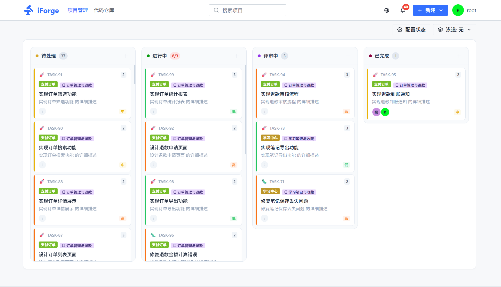
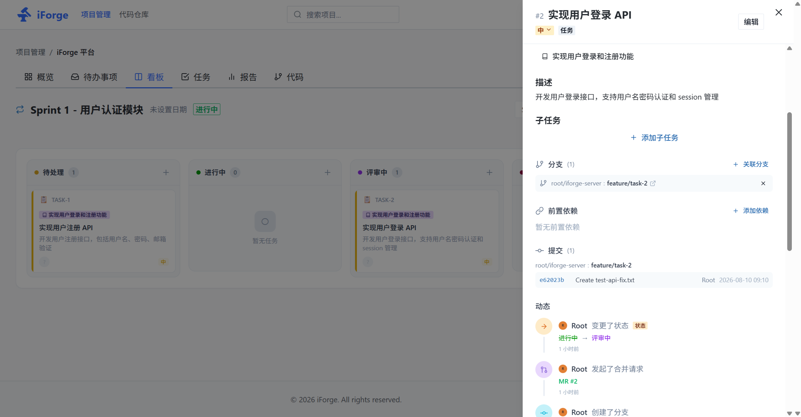

<div align="center">

[中文](README.md) | [English](README.en-US.md)

# iForge

### 将任务、代码与交付串联起来的自托管研发协作平台

[](https://go.dev/)
[](https://nodejs.org/)
[](LICENSE)

[在线演示](#在线演示) · [快速开始](#快速开始) · [核心能力](#核心能力) · [部署](#生产部署) · [架构](#架构) · [开发](#本地开发)





## 在线演示

访问 [https://demo.iforge-go.com](https://demo.iforge-go.com) 体验完整功能。

| 用户名 | 密码 | 角色 |
|--------|------|------|
| iforge | iforge | 管理员 |

演示站每日凌晨 3:00 自动重置数据。

</div>

## iForge 是什么

iForge 面向希望把项目管理和代码协作放在同一工作流中的团队。它将 **Story / Task、Git 分支、提交、合并请求（MR）、CI/CD 与发布**连接在一起，让工作项从需求到交付可追溯、可协作。

```text
需求 → Story / Task → 分支 → 提交 → MR / 评审 → Pipeline → 发布
```

项目可自托管，提供浏览器界面、Git HTTP/SSH 协议和外置 Runner 接入能力。

## 核心能力

| 领域 | 能力 |
| --- | --- |
| 代码托管 | 仓库创建、导入、Fork、分支与标签、文件浏览、Diff、归档下载、Git HTTP 和 SSH |
| 协作与评审 | Issue、评论、标签、里程碑、合并请求、逐行评论、Approve / Request changes、分支保护 |
| 敏捷管理 | 项目、Sprint、Epic、Story、Task、看板、依赖、工时、状态流转与活动记录 |
| AI 辅助 | AI 驱动的任务拆解与用户故事生成，支持自定义模型配置，辅助需求分析与工作优化 |
| 任务驱动开发 | 从任务创建/关联分支，提交与 MR 关联工作项，交付状态可回溯 |
| CI/CD | `.iforge-ci.yml` 流水线、DAG 依赖、日志、制品、环境、部署、定时任务与外置 Runner |
| 通知与集成 | WebSocket 实时通知、Webhook、插件事件、邮件通知、LDAP / OIDC 认证选项 |
| 平台管理 | 组织与成员、访问令牌、SSH/GPG Key、审计、系统设置与 AI 模型配置 |

## 快速开始

最简单的本地体验方式是 Docker Compose。默认使用 SQLite，适合本地开发和功能体验。

```bash
git clone https://github.com/iforge-go/iforge.git
cd iforge

cp .env.example .env
docker compose up -d --build
```

启动后访问 `http://localhost:3000`，首次使用时完成管理员初始化。

常用命令：

```bash
docker compose logs -f
docker compose down
```

Git HTTP 默认映射到宿主机 `8080`，SSH 默认映射到 `22`。若端口冲突，请在 `.env` 中调整 `IFORGE_HTTP_PORT` 与 `IFORGE_SSH_PORT`。

## 生产部署

### 数据库选择

| 场景 | 建议 |
| --- | --- |
| 本地开发、演示、单人体验 | SQLite |
| 已运行的生产环境 | MySQL 8.0+ |
| 新生产环境、复杂查询或未来多实例规划 | PostgreSQL 16+ |

MySQL 8 是受支持的生产数据库，无须为性能原因立即迁移。SQLite 不适合多实例或高并发写入场景。

启动 MySQL 生产配置：

```bash
# 在 .env 中设置强密码、固定会话密钥，并指定数据库驱动
IFORGE_DB_DRIVER=mysql
MYSQL_ROOT_PASSWORD=<strong-password>
MYSQL_PASSWORD=<strong-password>
IFORGE_SESSION_SECRET=<random-secret>

docker compose --profile mysql up -d --build
```

启动 PostgreSQL：

```bash
IFORGE_DB_DRIVER=postgres
POSTGRES_PASSWORD=<strong-password>
IFORGE_SESSION_SECRET=<random-secret>

docker compose --profile postgres up -d --build
```

生产环境应额外完成：

- 为 `IFORGE_SESSION_SECRET` 设置固定的高熵值；多副本必须共用同一密钥。
- 将 `IFORGE_CORS_ORIGINS` 收紧为实际前端域名。
- 不要将数据库端口直接暴露到公网；通过反向代理提供 HTTPS。
- 为 `data/`（仓库、日志和 SQLite 数据）或外部数据库执行定期备份与恢复演练。
- 使用外置 Runner 时设置 `IFORGE_DISABLE_BUILTIN_EXECUTOR=true`，并限制 Runner 的权限和网络访问。

### 连接池

MySQL/PostgreSQL 每个 iForge 服务实例默认使用最多 30 个、空闲 10 个数据库连接。可通过 `.env` 调整：

```bash
IFORGE_DB_MAX_IDLE_CONNS=10
IFORGE_DB_MAX_OPEN_CONNS=30
IFORGE_DB_CONN_MAX_LIFETIME_SECONDS=1800
IFORGE_DB_CONN_MAX_IDLE_TIME_SECONDS=300
```

连接上限应按应用实例数与数据库 `max_connections` 一起规划，避免所有实例的连接上限之和超过数据库可承受范围。

## 架构

```text
┌─────────────────────────────────────────────────────────────────┐
│                        Nginx 反向代理                            │
│              iforge-nginx (独立仓库统一管理)                       │
│                                                                  │
│   iforge-go.com ──────► iforge-site (文档站)                     │
│   www.iforge-go.com ──► iforge-site (文档站)                     │
│   demo.iforge-go.com ─┬─► iforge-web (前端)                     │
│                       └─► iforge-server (后端)                   │
└─────────────────────────────────────────────────────────────────┘
                              │
┌─────────────────────────────┼───────────────────────────────────┐
│                        iForge 平台                               │
│                                                                  │
│  ┌───────────────┐       HTTP / WebSocket       ┌──────────────┐│
│  │ Next.js Web   │ ───────────────────────────► │ Go + Fiber   ││
│  │ Next.js 16    │                               │ Server       ││
│  └───────────────┘                               │ API·Git·SSH  ││
│                                                  └──────┬───────┘│
│                                                         │        │
│                                                 ┌───────▼──────┐│
│                                                 │  Database    ││
│                                                 │  SQLite /    ││
│                                                 │  MySQL /     ││
│                                                 │  PostgreSQL  ││
│                                                 └──────────────┘│
│                                                         │        │
│                                                 ┌───────▼──────┐│
│                                                 │ CI/CD Runner ││
│                                                 └──────────────┘│
└──────────────────────────────────────────────────────────────────┘
```

后端采用分层目录：`handler` 处理 HTTP、`service` 承载业务逻辑、`model` 描述数据模型、`git` 封装 Git 操作、`event` / `subscriber` 处理领域事件，`container` 负责依赖装配。前端采用 Next.js App Router、React 和 Chakra UI。

### 相关仓库

| 仓库 | 说明 |
|---|---|
| [iforge](https://gitee.com/guanshiliang/gitgot) | 主平台（server + web） |
| [iforge-site](https://gitee.com/guanshiliang/iforge-site) | 官方文档站（Docusaurus） |
| [iforge-runner](https://gitee.com/guanshiliang/iforge-runner) | CI/CD 执行器（独立部署） |
| [iforge-nginx](https://gitee.com/guanshiliang/iforge-nginx) | Nginx 反向代理配置（统一管理域名路由） |

### 当前部署边界

当前版本适合单实例自托管。WebSocket 连接、领域事件与内置 CI 调度主要在进程内运行；如需多实例高可用，应先规划共享 Git 存储、跨节点消息分发、分布式锁与外置 Runner。

## 本地开发

### 依赖

- Go 1.26+
- Node.js 18+
- Git 2.30+
- Docker 20.10+（推荐，用于本地依赖和 CI/CD）

### 启动后端

```bash
cd server
go run ./cmd/server
```

后端默认监听 `8081`。如使用 MySQL 或 PostgreSQL，请先配置 `server/config.yaml` 或相应的 `IFORGE_*` 环境变量；可参考 `server/config.prod.mysql.yaml` 与 `server/config.prod.pg.yaml`。

### 启动前端

```bash
cd web
npm install
npm run dev
```

前端默认监听 `http://localhost:3001`。

## 配置参考

| 变量 | 说明 | 默认值 |
| --- | --- | --- |
| `IFORGE_HOME` | 数据目录 | `./data` |
| `IFORGE_HTTP_PORT` | 后端 HTTP / Git HTTP 端口 | `8081` |
| `IFORGE_SSH_PORT` | Git SSH 端口 | `2022` |
| `IFORGE_DB_DRIVER` | `sqlite`、`mysql` 或 `postgres` | `sqlite`（Compose） |
| `IFORGE_SESSION_SECRET` | 会话签名密钥 | 首次启动生成 |
| `IFORGE_CORS_ORIGINS` | 允许的前端来源 | `*` |
| `IFORGE_DISABLE_BUILTIN_EXECUTOR` | 禁用内置 CI 执行器 | `false` |

完整示例见 [`.env.example`](.env.example)；后端文件配置见 [`server/config.example.yaml`](server/config.example.yaml)。

## 项目结构

```text
iforge/
├── server/                 Go/Fiber 后端与 Git 服务
│   ├── cmd/server/         服务入口
│   └── internal/           领域模块、路由、服务与基础设施
├── web/                    Next.js 前端
├── plugins/                插件示例
├── docker-compose.yml      本地与容器化部署（支持 SQLite/MySQL/PostgreSQL）
├── .env.example            环境变量示例
└── deploy/                 部署配置（已迁移到独立仓库 iforge-nginx）
```

## 贡献

欢迎提交 Issue、改进文档和 Pull Request。提交前请尽量完成相关测试与格式化：

```bash
cd server && go test ./...
cd web && npm run lint && npm run build
```

请在 PR 中说明变更目的、验证方式，以及是否涉及数据库迁移或部署配置。

## 许可证

本项目采用 [Apache License 2.0](LICENSE) 及附加条件发布。使用前请阅读完整许可证文本。
